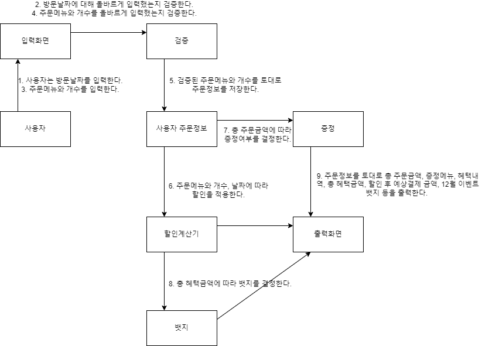

### 객체 간의 협력관계 파악하기


### 프로그래밍 요구사항

- [ ✅ ] JDK 17 버전에서 실행 가능해야 한다.
- [ ✅ ] indent(인덴트, 들여쓰기) depth를 3이 넘지 않도록 구현한다. 2까지만 허용한다.
- [ ✅ ] 3항 연산자를 쓰지 않는다.
- [ ✅ ] JUnit 5와 AssertJ를 이용하여 본인이 정리한 기능 목록이 정상 동작함을 테스트 코드로 확인한다.
- [ ✅ ] else 예약어를 쓰지 않는다.
- [ ✅ ] 도메인 로직에 단위 테스트를 구현해야 한다.

### 추가 요구사항
- [ ✅ ] 아래 있는 InputView, OutputView 클래스를 참고하여 입출력 클래스를 구현한다.
```
public class InputView {
    public int readDate() {
        System.out.println("12월 중 식당 예상 방문 날짜는 언제인가요? (숫자만 입력해 주세요!)");
        String input = Console.readLine();    
        // ...
    }
    // ...
}
```

```
public class OutputView {
    public void printMenu() {
        System.out.println("<주문 메뉴>");
        // ...
    }
    // ...
}
```

MVC패턴으로 작성한다.

### Controller
- ChristmasController (크리스마스 이벤트를 실행하기 위한 클래스)

### Model
- Category (메뉴 카테고리를 담당하는 클래스)
- DateInfo (사용자가 방문할 날짜를 관리하기 위한 클래스)
- DiscountCalculator (할인을 계산하기 위한 클래스)
- EventBadge (뱃지를 적용하기 위한 클래스)
- MenuItem (제시된 메뉴를 담당하기 위한 클래스)
- OrderInfo (사용자 주문 정보를 담당하는 클래스)
- Promotion (증정을 처리할 클래스)

### View
- InputView (입력을 담당하는 클래스)
- OutputView (출력을 담당하는 클래스)

### 기능요구사항

- [ ✅ ] 예상 방문 날짜를 입력한다.
    - 1이상 31이하의 숫자로만 입력한다.
        - 1이상 31이하의 숫자가 아닌경우, [ERROR] 유효하지 않은 날짜입니다. 다시 입력해 주세요. `llegalArgumentException` 예외를 처리한다.
- [ ✅ ] 주문메뉴와 개수를 입력한다.
    - 음료만 주문하는 경우, 주문할 수 없다.
    - 메뉴는 한번에 최대 20개까지 주문가능하다.
    - 메뉴판에 없는 메뉴를 입력한 경우, [ERROR] 유효하지 않은 주문입니다. 다시 입력해 주세요.
    - 메뉴의 개수는 1이상의 숫자만 입력한다.
        - 이외의 입력값은 [ERROR] 유효하지 않은 주문입니다. 다시 입력해 주세요.
    - 메뉴 형식이 예시와 다른 경우,
        - [ERROR] 유효하지 않은 주문입니다. 다시 입력해 주세요.
    - 중복 메뉴를 입력한 경우(ex: 시저샐러드-1,시저샐러드-1),
        - [ERROR] 유효하지 않은 주문입니다. 다시 입력해 주세요.
- [ ✅ ] 총 주문 금액과 방문날짜에 따라 할인을 적용한다.
    - 크리스마스 디데이 할인을 적용한다.
    - 방문날짜가 평일이라면, 평일 할인을 적용한다.
    - 방문날짜가 주말이라면, 주말 할인을 적용한다.
    - 특별할인을 적용한다.
    - 총주문 금액이 12만 원 이상일 때, 샴페인 1개 증정한다.
- [ ✅ ] 총 혜택금액에 따라 뱃지를 증정한다.
  - 5천원이상 혜택을 받았다면, 별을 부여한다.
  - 1만원이상 혜택을 받았다면, 트리를 부여한다.
  - 2만원이상 혜택을 받았다면, 산타를 부여한다.

- [ ✅ ] 아래와 같은 형태로 출력한다.
    ```
    12월 26일에 우테코 식당에서 받을 이벤트 혜택 미리 보기!
    
    <주문 메뉴>
    타파스 1개
    제로콜라 1개
    
    <할인 전 총주문 금액>
    8,500원
    
    <증정 메뉴>
    없음
    
    <혜택 내역>
    없음
    
    <총혜택 금액>
    0원
    
    <할인 후 예상 결제 금액>
    8,500원
    
    <12월 이벤트 배지>
    없음
    ```